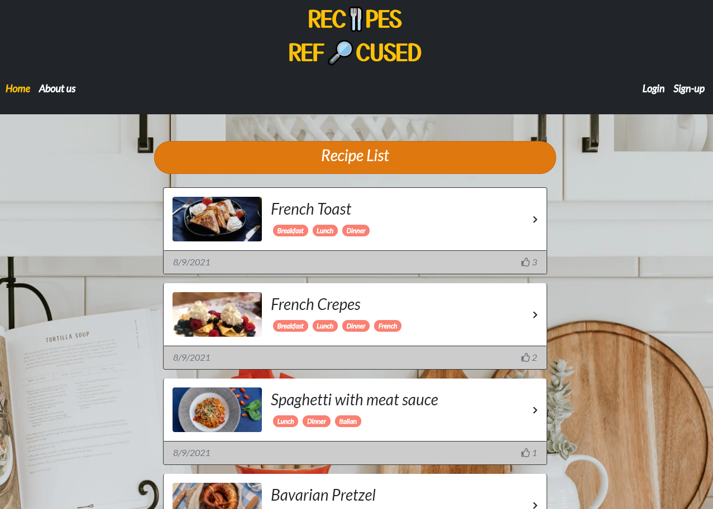
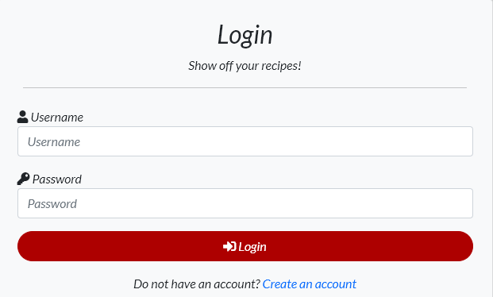
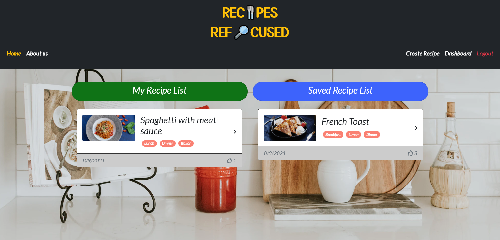
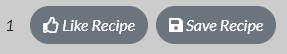

<h1 align="center"><strong>Recipes Refocused</strong></h1>

    
    
    
    
    
    

<h2 align="center">
  <a href="https://recipes-refocused.herokuapp.com/">Deployed Site</a>
</h2>

## Description:

Ready to trim the fat? Recipes Refocused is the newer, faster way explore recipes. On this site all recipes follow the same format so you can get right to learning new kitchen techniques instead of wading through pages of history. Posts are available for anyone to view, but if you'd like to interact with our awesome community, be sure to create an account!

## Table of Contents

- [Instructions](#instructions)
- [Contributors](#contributors)
- [Questions](#questions)
- [License](#license)

## Instructions

1. Follow <a href="https://recipes-refocused.herokuapp.com/">this link</a> to navigate to Recipes Refocused.

2. On the landing page you can view recipes, sign-up for an account, or log into your account if you already have one.

3. When you click on a recipe you will be redirected to the recipes page where you will see all of the reipes information.
4. If you are logged into your account, you can leave a comment on a recipe, save the recipe to your account, or "like" the recipe.
5. Logged In users will have four buttons in the nav bar: Home, Create Recipe, Dashboard, and Logout
6. Users can create a new recipe by clicking on the Create Recipe button, this will navigate you to the create recipe page where you will see inputs for the following information:
    * Recipe Title
    * Recipe Genre Tags
    * An upload button to add an image to your recipe
    * Prep Time
    * Cook Time
    * Ingredients
    * Steps 
7. Clicking the Post Recipe button will save the recipe to the server, you can also click the Cancel button to stop saving the recipe at any time.
8. After posting a recipe, you can choose to edit it if you made any mistakes.
9. Clicking on the Home button will navigate you to the homepage.
10. Clicking on the Dashboard button will navigate you to your own dashboard page where you can:
    * View recipes you have posted
    * View recipes you have clicked the Save button on
    * Create a new recipe

11. You can leave a comment on any recipe you are viewing
12. If you are logged in you can leave a like on a recipe, as well as save it to your profile for later viewing

13. When you are done using the site, don't forget to log out.

## Contributors

* <a href="https://github.com/rhwlffk1028">Kevin Choi</a> - Frontend

* <a href="https://github.com/kkolyvek">Koppi Kolyvek</a> - Frontend

* <a href="https://github.com/kcmuse">Kaleb Muse</a> - Backend

* <a href="https://github.com/TheHebi">Nathaniel Turcotte</a> - Backend

## Quesions

If you have any questions, contact me <a href="https://github.com/TheHebi" target="_blank">here</a>, or send me an email at nturcotte8@live.com.

## License

This project uses the MIT License
